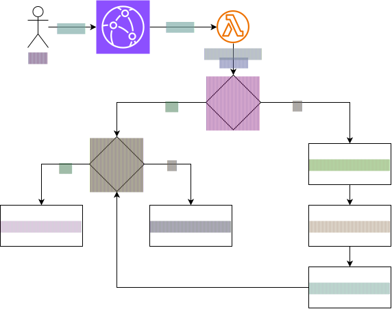
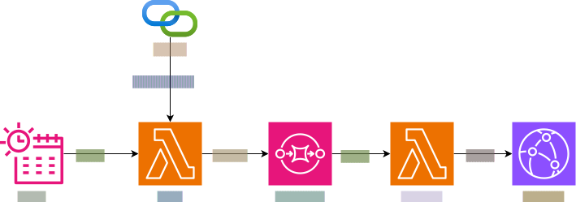
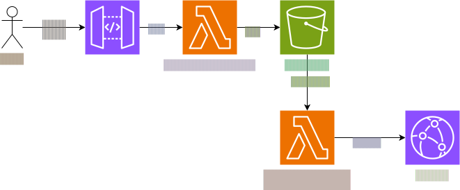

[](https://app.codacy.com/gh/SimonJPegg/portcullis/dashboard?utm_source=gh&utm_medium=referral&utm_content=&utm_campaign=Badge_grade)

# Portcullis

Distributed policy enforcement at the edge.

Evaluates requests against OPA/WASM policies before they reach their destination. First use case: package registries. Blocks vulnerable and untrusted dependencies at the download boundary before they enter your supply chain.

## Architecture

### Request Path



### Background Path



### Admin Path



### Initial Design Decisions

- **Fail-closed.** Unknown packages blocked until evaluated. This is a security boundary.
- **Sync with timeout on first hit.** If enrichment takes too long, deny. Verdict cached for retry.
- **No package hosting.** Pure proxy. Upstream is the source of truth for bytes.
- **WASM at the edge.** V8's native WebAssembly API evaluates compiled OPA policies in-process. No sidecar, no network hop.
- **Pre-computed verdicts.** Background pipeline keeps KVS current. Lambda@Edge only does inline evaluation on cache miss.
- **Protocol-agnostic core.** Normalised package coordinate (`ecosystem`, `name`, `version`) used throughout. Format-specific parsing lives in thin adapters at the boundary.

### Storage

| Store | Purpose |
|-------|---------|
| CloudFront KVS | Verdicts. Edge-local, sub-ms reads. |
| DynamoDB | Policies, tracked packages, vuln high-water mark. |
| S3 | Compiled WASM binaries, Rego source. |

### Tech

| Layer | Language | Why |
|-------|----------|-----|
| Enforcement (edge) | TypeScript | Lambda@Edge native runtime, V8 WASM built-in |
| Background + admin | Go | OPA toolchain native, fast cold starts, single binary |
| Infrastructure | Terraform | Self-hostable, one `terraform apply` |
| Policy language | Rego → WASM | Industry standard, composable, compiles to portable binary |

## Policies

Two initial policies. Both compile to WASM via OPA.

**Package age** — deny packages published less than N days ago. No 0-days in your supply chain.

**Vulnerability severity** — deny packages with known vulns at or above a threshold (e.g. no HIGH or CRITICAL).

Policies evaluate in precedence order. All run, all apply. Composite verdict written to KVS.

## Status

| Phase | State |
|-------|-------|
| Foundation (domain model, verdict store, OSV client) | 🔜 |
| Policy engine (Rego, WASM compilation, evaluation) | — |
| Enforcement (Lambda@Edge, CloudFront, PyPI adapter) | — |
| Background pipeline (OSV poll, re-evaluation) | — |
| Admin API (policy CRUD, bulk re-eval) | — |
| Hardening (observability, load testing, Maven adapter) | — |

## Structure

```
portcullis/
├── edge/           # TypeScript — Lambda@Edge enforcement
├── backend/        # Go — poll, evaluate, admin Lambdas
├── infra/          # Terraform
├── policies/       # Rego source + compiled WASM
├── docs/
│   └── decisions/
├── loadtest/
└── Makefile
```

## Deploy

```bash
cd infra/
terraform init
terraform apply
```

Prerequisites: AWS account, OPA CLI (for policy compilation), Terraform >= 1.x.

## Why

I enjoyed working on [sluice](https://github.com/SimonJPegg/sluice) and all the interesting bits are done.
